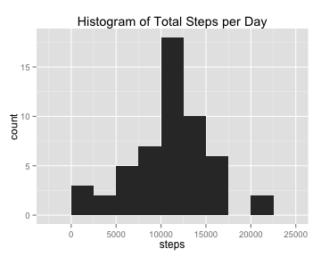
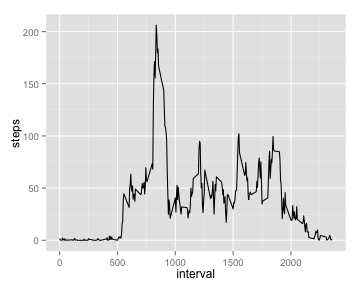
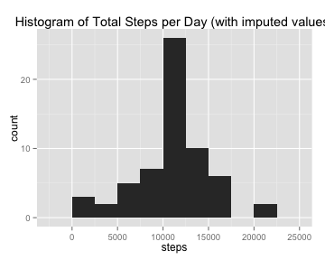

# Reproducible Research: Peer Assessment 1
This assignment uses data from a personal activity monitoring devices to examine average activity patterns on weekdays and weekends.

## Loading and preprocessing the data

Load the data and transform the date values to R date format. Calculate the total number of steps per day and create a second data set: "sumbyday".


```r
activity <- read.csv("activity.csv")
activity[,2] <- as.Date(activity[,2])
sumbyday <- aggregate(steps~date,data=activity,sum,na.rm=TRUE)
```

## What is mean total number of steps taken per day?

Using ggplot2, create a histogram of the total steps per day.

```r
library(ggplot2)
qplot(steps, data=sumbyday, geom="histogram", main="Histogram of Total Steps per Day", binwidth = 2500)
```

 

Next, calculate the mean and median number of steps per day.

```r
stepmean <- mean(sumbyday$steps)
stepmedian <- median(sumbyday$steps)
table <- matrix(c(stepmean,stepmedian),ncol=2,byrow=TRUE)
colnames(table) <- c("Mean", "Median")
```

The mean and median steps per day are displayed below in a table.

```r
print(table)
```

```
##       Mean Median
## [1,] 10766  10765
```

## What is the average daily activity pattern?

Calculate the mean number of steps per interval using aggregate function.

```r
stepsbyint <- aggregate(steps~interval,data=activity,mean,na.rm=TRUE)
```

Create a time series plot of the 5-minute interval and the average number of steps taken, averaged across all days.

```r
ggplot(stepsbyint, aes(interval, steps)) + geom_line()
```

 

Determine which 5-minute interval, on average across all the days in the dataset, contains the maximum number of steps. (Interval 835)


```r
which.max(stepsbyint$steps)
```

```
## [1] 104
```

```r
print(stepsbyint[104,])
```

```
##     interval steps
## 104      835 206.2
```

## Imputing missing values

Calculate and report the total number of missing values in the dataset.

```r
sum(is.na(activity$steps))
```

```
## [1] 2304
```

Impute missing values by replacing NA values with mean number of steps per interval. 


```r
impute_activity <- merge(activity, stepsbyint, by="interval", suffixes=c("",".y"), all = TRUE)
NAs <- is.na(impute_activity$steps)
impute_activity$steps[NAs] <- impute_activity$steps.y[NAs]
impute_activity <- impute_activity[,c(1:3)]
```

Check to make sure there are no more NAs.

```r
sum(is.na(impute_activity$steps))
```

```
## [1] 0
```

Create a histogram of the total steps per day using imputed dataset.

```r
impute_sumbyday <- aggregate(steps~date,data=impute_activity,sum,na.rm=TRUE)
library(ggplot2)
qplot(steps, data=impute_sumbyday, geom="histogram", main="Histogram of Total Steps per Day (with imputed values)", binwidth = 2500)
```

 

Calculate the mean and median number of steps per day for the imputed dataset.

```r
impute_stepmean <- mean(impute_sumbyday$steps)
impute_stepmedian <- median(impute_sumbyday$steps)
impute_table <- matrix(c(impute_stepmean,impute_stepmedian),ncol=2,byrow=TRUE)
colnames(impute_table) <- c("Mean", "Median")
```

The mean and median steps per day for imputed dataset are displayed below in a table. Imputing missing values did not have much impact on the steps per day summary statistics.


```r
print(impute_table)
```

```
##       Mean Median
## [1,] 10766  10766
```

## Are there differences in activity patterns between weekdays and weekends?

Create a new factor variable in the dataset with two levels – “weekday” and “weekend” indicating whether a given date is a weekday or weekend day.


```r
impute_activity$day <- (weekdays(impute_activity$date))
impute_activity$day <- gsub("Saturday", "weekend", impute_activity$day)
impute_activity$day <- gsub("Sunday", "weekend", impute_activity$day)
impute_activity$day <- gsub("Monday", "weekday", impute_activity$day)
impute_activity$day <- gsub("Tuesday", "weekday", impute_activity$day)
impute_activity$day <- gsub("Wednesday", "weekday", impute_activity$day)
impute_activity$day <- gsub("Thursday", "weekday", impute_activity$day)
impute_activity$day <- gsub("Friday", "weekday", impute_activity$day)
```

Calculate the mean number of steps per interval for weekdays and weekends.

```r
weekday_stepsbyint <- aggregate(steps~interval,data=impute_activity,mean, 
                                subset=impute_activity$day=="weekday", na.rm=TRUE)
weekend_stepsbyint <- aggregate(steps~interval,data=impute_activity,mean, 
                                subset=impute_activity$day=="weekend", na.rm=TRUE)
```

Make a panel plot of the 5-minute interval and the average number of steps taken, averaged across all weekday days or weekend days.


```r
p1 <- ggplot(weekend_stepsbyint, aes(interval, steps)) + geom_line() + ggtitle("Weekends")
p2 <- ggplot(weekday_stepsbyint, aes(interval, steps)) + geom_line() + ggtitle("Weekdays")
library(gridExtra)
```

```
## Loading required package: grid
```

```r
grid.arrange(p1, p2, ncol=1)
```

 
